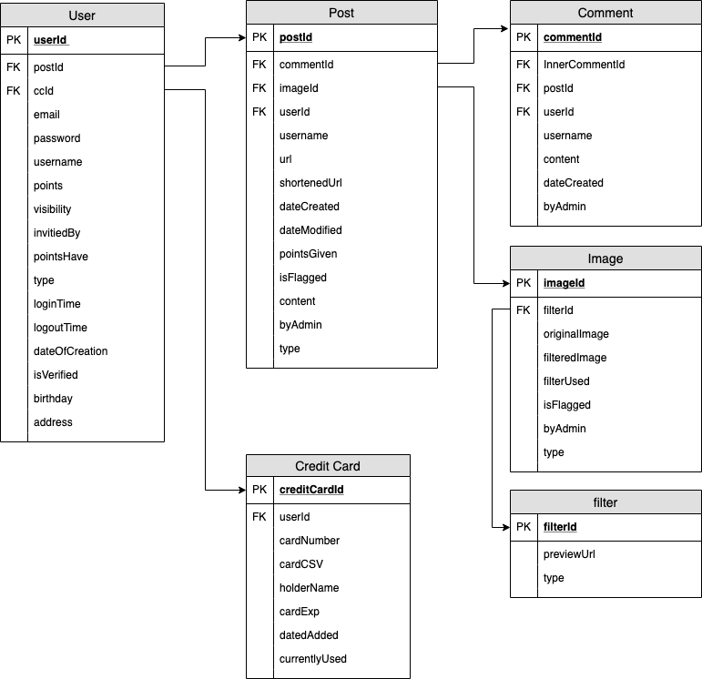

# High-Level-Requirements

As the database team, we are envisioning creating a relational database with PostgreSQL with a data table for every possible class in the system. This allows us to abstract much of the functionality in our interface, where there will be fundamental "getter" and "setter" methods that the backend development teams will use to access the database. From here, each class will extend from our fundamental interface class. This allows each class to add methods that are specific to the data items associated with each class. Overall, this enhances organization because we will not have to deal with cumbersome amounts of data associated with each class, thus allowing us to simplify the process of accessing and altering data with each object in the system.

We will be implementing this using an Adapter Design Pattern. This design pattern allows us to create a universal interface that will allow functionality between classes that the backend model teams create and use. Specifically, it will allow the backend model teams to use our singular DBAdapter class for all of their database needs. They will need to pass in the object type they wish to work with and then there will be methods available to them relating to member, image, post, comment, and other objects. This simplifies things for the backend teams as they will not have to work with a myriad of files and libraries in order to properly use the database. This will minimize errors and centralize database access and manipulation.  

As an overarching example, the fundamental methods of our interface will be something like:
 - get_id
 - set_id
 - remove_item
 
Each subsequent class will inherit these methods and then define class specific ones. An example for the User object would be:
 - get_id
 - set_id
 - remove_item
 - get_email
 - set_email
 - get_pw
 - set_pw
 - get_cc_num
 - set_cc_num
 - get_is_admin
 - set_is_admin
 - get_is_idol
 - set_is_idol

###  Adapter Pattern Design 

### Data Tables 

#### User
| Field Name     | Data Type |
|----------------|-----------|
| userID         | integer   |
| postID         | integer[] |
| ccID           | integer   |
| email          | varChar   |
| password       | varChar   |
| username       | varChar   |
| points         | interger  |
| visibility     | integer[] |
| invitedBy      | integer   |
| type           | varChar   |
| loginTime      | date/time |
| logoutTime     | date/time |
| dateOfCreation | date/time |
| isVerified     | boolean   |
| birthday       | date/time |
| address        | varChar   |

#### Credit Card
| Field Name    | Data Type |
|---------------|-----------|
| userID        | integer   |
| cardNumber    | integer   |
| cardCSV       | integer   |
| holderName    | varChar   |
| cardExp       | integer   |
| dateAdded     | date/time |
| currentlyUsed | boolean   |

#### Post
| Field Name   | Data Type |
|--------------|-----------|
| postID       | integer[] |
| commentID    | integer[] |
| imageID      | integer[] |
| userID       | integer   |
| username     | varChar   |
| url          | varChar   |
| shortenedURL | varChar   |
| dateCreated  | date/time |
| dateModified | date/time |
| isFlagged    | boolean   |
| pointsGiven  | integer   |
| content      | textfield |
| byAdmin      | boolean   |
| type         | varChar   |

#### Comment
| Field Name     | Data Type |
|----------------|-----------|
| innerCommentID | Integer[] |
| postID         | integer   |
| userID         | integer   |
| username       | varChar   |
| content        | textField |
| dateCreated    | date/time |
| byAdmin        | boolean   |
#### Image
| Field Name    | Data Type  |
|---------------|------------|
| filterID      | Integer[]  |
| originalImage | ImageField |
| filteredImage | ImageField |
| filterUsed    | boolean    |
| isFlagged     | boolean    |
| type          | varChar    |
| byAdmin       | boolean    |

#### Filter
| Field Name | Data Type |
|------------|-----------|
| filterID   | id        |
| type       | varChar   |
| previewURL | varChar   |

 ###  Class Method Calls 

 

### ER diagrams

#### Entire System

