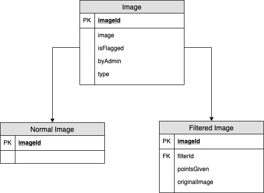

# High-Level-Requirements

As the database team, we are envisioning creating a relational database with PostgreSQL where there is a data table for every possible class in the system. This will allow us to abstract a lot of the functionality in our interface, where there will be a fundamental set of "getter" and "setter" methods that the backend development teams can use to access the database. From here, each class will extend from our fundamental interface class. This will allow each class to add methods that are specific to the data items that will be associated with each class. Overall, this will enhance organization because we will not have to deal with having cumbersome amounts of data associated with each class, thus allowing us to simplify the process of accessing and altering data with each object in the system.

Additionally, we will be implementing this using an Adapter Design Pattern. This design pattern allows us to create a universal interface that will allow functionality inbetween classes that backend model teams create and use. Specifically, it will allow backend model teams to use our singular DBAdaptor class for all of their database needs. They will just need to pass in the object type that they wish to work with and then there will be methods available to them relating to member, image, post, comment, and more objects. This way backend teams will not have to work with a myriad of files and libraries just to properly use the database. This will minimize errors and centralize database access and manipulation.  

As an overarching example, the fundamental methods of our interface will be something like:
 - get_id
 - set_id
 - remove_item
 
Then, each subsequent class will inherit these methods and then define class specific ones. An example for the User object would be:
 - get_id
 - set_id
 - remove_item
 - get_email
 - set_email
 - get_pw
 - set_pw
 - get_cc_num
 - set_cc_num
 - get_is_admin
 - set_is_admin
 - get_is_idol
 - set_is_idol

##  Adapter Pattern Design 
 

 ## Data Tables 
  
  ### User
  | ID | First Name | Last Name | Email | Password | CC Number | Is Admin |  Is Idol | Points | Visibility | Invited By | DOB | Address | Phone Number |
  | :- |:----: |:-----: |:---: | :------: | :-------: | :-: | :-----: | :----: | :---: | :----: | :----: | :----: | :----: |
  | Integer | String | String | String |String | String | Boolean | Boolean | Integer | Boolean | ID | Date and Time Field| String | String |
  
  ### URL
  | ID | Text/Link | Shortened URL Key | User Key | Associated Website |
  | :- | :---: | :------: | :-------: | :-: |
  | Integer | String | Integer | Integer | String |
  
  ### Shortened URL
  | ID | Text/Link | Shortened URL Key | User Key | Associated Website |
  | :- | :---: | :------: | :-------: | :-: |
  | Integer | String | Integer | Integer | String |
  
  ### Sponsored Items
  | ID | Company | Points Given | Description | Size | Times Used |
  | :- | :---: | :------: | :-------: | :-: | :-----: |
  | Integer | String | Integer | String | Int x Int | Integer |
  
  ### Comment
  | ID | User Key | Original Post Key | Content of Comment | Date Created | Points Given |
  | :- | :---: | :------: | :-------: | :----: | :-----: |
  | Integer | Integer | Integer | String | Date and Time Field | Integer |
  
  ### Filtered Image
  | ID | Filters Key | Sponsored Items Key | Original Image Key | Points Given | Done by Admin | Post Key | Date Created | User Key | 
  | :- | :-----: | :------: | :-------: | :-----: | :----: | :----: | :----: | :----: |
  | Integer | Integer | Integer | Integer | Integer | Boolean | Integer | Date & Time Field | Integer |
  
  ### Filters
  | ID | Filter Name | Description | Points Given |
  | :- | :---: | :------: | :-------: |
  | Integer | String | String | Integer |
  
  ### Image
  | ID | User Key | Image Format | Date Created | Associated Website | Flagged | Filtered Photo Key | Post Key |
  | :- | :---: | :------: | :-------: | :-: | :-----: | :----: | :----: |
  | Integer | String | String | Date & Time Field | String | Boolean | Integer | Integer |

  ### Post
  | ID  | Image Key | Comment Key | User Key | Date Created | Date Modified | Content | Is Flagged | 
  | :- | :---: | :------: | :-------: | :-: | :-----: | :----: | :----: |
  | Integer | Integer | Integer | Integer | Date & Time Field | Date & Time Field | String | Boolean | 
  

 ##  Class Method Calls 
### URL
 - get_id()
 - set_id()
 - remove_item()
 - get_link()
 - set_link()
 - get_shortened_key()
 - set_shortened_key()
 - get_user_key()
 - set_user_key()
 - get_website()
 - set_website()
 
 ### Shortened URL
 - get_id()
 - set_id()
 - remove_item()
 - get_link()
 - set_link()
 - get_original_key()
 - set_original_key()
 - get_user_key()
 - set_user_key()
 - get_website()
 - set_website()
 
### Sponsored Item
 - get_id()
 - set_id()
 - remove_item()
 - get_company()
 - set_company()
 - get_points()
 - set_points()
 - get_description()
 - set_description()
 - get_size()
 - set_size()
 - get_times_used()
 - set_times_used()
 
### Comment
 - get_id()
 - set_id()
 - remove_item()
 - get_key_post()
 - set_key_post()
 - get_comment()
 - set_comment()
 - get_time_posted()
 - set_time_posted()
 - get_points()
 - set_points()
 
### Filtered Image
 - get_id()
 - set_id()
 - remove_item()
 - get_filters()
 - set_filters()
 - get_user_key()
 - set_user_key()
 - get_added_items()
 - set_added_items()
 - get_post()
 - set_post()
 - get_points()
 - set_points()
 - get_done_by_admin()
 - set_done_by_admin()
 - get_time()
 - set_time()
 
### Filters
 - get_id()
 - set_id()
 - remove_item()
 - get_name()
 - set_name()
 - get_description()
 - set_description()
 - get_points()
 - set_points()
 
### Image
 - get_id()
 - set_id()
 - remove_item()
 - get_post()
 - set_post()
 - get_time()
 - set_time()
 - get_user_key()
 - set_user_key()
 - get_format()
 - set_format()
 - get_time()
 - set_time()
 - get_website()
 - set_website()
 - get_is_flagged()
 - set_is_flagged()
 - get_filtered()
 - set_filtered()
 
### Post
 - get_id()
 - set_id()
 - remove_item()
 - get_image()
 - set_image()
 - get_comments()
 - set_comments()
 - get_user_key()
 - set_user_key()
 - get_time_modified()
 - set_time_modified()
 - get_time()
 - set_time()
 - get_content()
 - set_content()
 - get_is_flagged()
 - set_is_flagged()
 

### ER diagrams

#### User

#### Image

#### Post

#### Entire System

